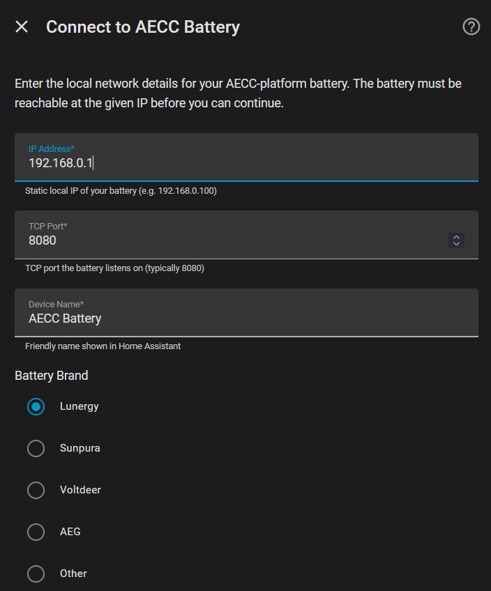
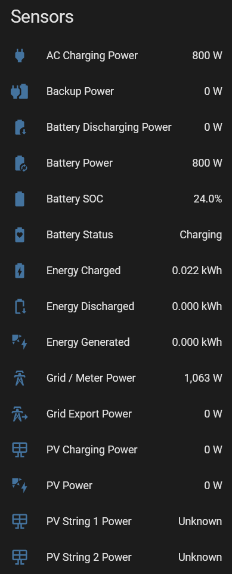
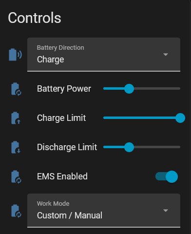
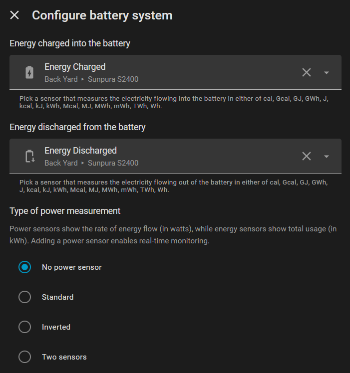

# AECC Battery (Local TCP)

A Home Assistant integration for **local TCP control** of AECC-platform home batteries. No cloud, no latency, no external dependencies.

Works with any battery built on the AECC platform: Lunergy, Sunpura, Voltdeer, AEG Solarcube, AFERIY, AccuMate, and others.

---

## Screenshots

| Setup | Sensors | Controls | Energy Dashboard |
|---|---|---|---|
|  |  |  |  |

---

## Features

- **100% local**: communicates directly with your battery over TCP (port 8080)
- **5-second polling**: near real-time updates with intelligent failure tolerance
- **Physics-aware sensor cleaning**: rejects sensor glitches (`SOC=0` during active discharge, impossible rate-of-change spikes) before they reach Home Assistant or pollute the Energy Dashboard. Tuned per brand.
- **Hybrid availability**: entities hold their last known value through brief sensor blips, then transition to `unavailable` after a sustained outage so automations and dashboards see an honest signal.
- **Write-back verification**: every control command is re-read after writing; mismatches are logged so silent firmware drops become visible.
- **Energy Dashboard ready**: accumulated kWh sensors (`total_increasing`) for the HA Energy Dashboard
- **Full battery control**: direction (Charge/Discharge/Idle), power slider (0-800W, extendable to 2400W), SOC limits
- **Work mode selector**: Self-Consumption (AI), Custom/Manual
- **Multi-brand**: select your brand during setup; DeviceInfo shows correct manufacturer and model
- **Multi-language**: English, Dutch, German, French

---

## Supported Brands

This integration works with batteries built on the AECC platform (ai-ec.cloud). The AECC platform is white-labeled by multiple battery brands that share the same local TCP protocol.

If your battery uses the AECC app (or a white-labeled version), connects to an `ai-ec.cloud` server, and has TCP port 8080 open on your local network, this integration should work.

### Tested Batteries

| Brand | Model | Status | Notes |
|---|---|---|---|
| **Sunpura** | S2400 | Fully tested | PV input and multi-battery setups confirmed working |
| **Lunergy** | Hub 2400 AC | Fully tested | TCP connection can be flaky; the integration handles reconnects automatically. Per-brand sensor cleaning rejects the known sensor-stuck-at-zero pattern. |
| **AEG** | Solarcube | Partial | Monitoring works ([#1](https://github.com/StekkerDeal/aecc-battery-local/issues/1)). Battery **power** control has no effect on this firmware (it ignores the control register and uses dedicated power registers instead); needs a register scan from an AEG owner to fix ([#8](https://github.com/StekkerDeal/aecc-battery-local/issues/8)) |
| **Voltdeer** | SR5000 | Community confirmed | Works out of the box |
| **AFERIY** | PS240 | Community confirmed | Multi-unit setup confirmed working ([#2](https://github.com/StekkerDeal/aecc-battery-local/issues/2)) |
| **AccuMate** | Plug-In Battery | Community confirmed | Works out of the box ([#6](https://github.com/StekkerDeal/aecc-battery-local/issues/6)) |
| **JET** | GreenARK Pro | Tested | Confirmed working on a loan test unit |

### Expected Compatible (Untested)

| Brand | Model | Notes |
|---|---|---|
| Other AECC brands |: | Any battery using the AECC / ai-ec.cloud platform may work |

**Have a different AECC brand?** We'd love to hear from you. Install the integration, try it out, and [open an issue](https://github.com/StekkerDeal/aecc-battery-local/issues) to let us know if it works (or doesn't). Your feedback helps us expand the tested battery list.

---

## Requirements

- Home Assistant **2024.1.0** or newer
- Battery on the **same local network** as Home Assistant
- Battery's **static IP address** and **TCP port** (typically 8080)

---

## Installation via HACS

1. Open **HACS** in Home Assistant
2. Go to **Integrations**
3. Click the three-dot menu > **Custom repositories**
4. Add `https://github.com/StekkerDeal/aecc-battery-local` as an **Integration**
5. Search for **AECC Battery** and click **Download**
6. Restart Home Assistant

---

## Manual Installation

1. Download the latest release from [GitHub Releases](https://github.com/StekkerDeal/aecc-battery-local/releases)
2. Copy the `custom_components/aecc_battery` folder into your Home Assistant `config/custom_components/` directory
3. Restart Home Assistant

---

## Configuration

1. Go to **Settings > Devices & Services > Add Integration**
2. Search for **AECC Battery (Local TCP)**
3. Enter your battery's **IP address**, **TCP port** (default 8080), and a **friendly name**
4. Select your **battery brand** from the dropdown (Lunergy, Sunpura, Voltdeer, AEG, Other)
5. Optionally enter the **model name** (e.g. Hub 2400 AC, S2400, SR)

You can update all settings at any time via the integration's **Configure** button.

### Extended Power Range

By default, the AECC platform limits power to **800W** (both locally and in the app). The battery hardware supports up to 2400W, but two settings must be changed to unlock higher power:

**Step 1: AECC App (one-time, per device):**

The AECC app has an "On Grid Output" setting (under Operating Mode Settings) that caps the maximum power the inverter will deliver. The factory default is **800W**. This setting is **not accessible via local TCP** and must be configured in the AECC app. Set it to your desired maximum (e.g. 2400W).

**Step 2: Integration:**

1. Go to the integration's **Configure** button
2. Enable **Extended power range (up to 2400W)**
3. The power slider increases from 0-800W to 0-2400W

> **Disclaimer:** Only enable extended power (above 800W) when the battery is connected to its own dedicated circuit.

---

## Sensor Reliability

The AECC TCP protocol on some devices (notably Lunergy) occasionally returns sensor values that are physically impossible, for example `SOC=0` while the battery is actively discharging at hundreds of watts. The underlying datalog gateway loses sync with the BMS and the JSON response defaults missing fields to `0` rather than marking them unavailable. Without protection these readings would pollute the Energy Dashboard accumulators and trigger automations on bogus thresholds.

The integration applies a small physics-aware filter before publishing readings to Home Assistant:

| Check | What it rejects |
|---|---|
| Zero-during-active-flow | `SOC=0` (or `power=0` on Lunergy) while the battery is clearly cycling |
| Rate-of-change | SOC changes faster than physically possible from one poll to the next |

When a reading is rejected, the entity holds its last known good value for up to **2 minutes** so brief blips don't break charts or automations. After that window the entity transitions to `unavailable` so prolonged sensor failures surface honestly. As soon as the cleaner accepts a reading again, the entity returns to normal.

**Per-brand thresholds.** The brand you select during setup determines the cleaning sensitivity. **Lunergy** gets the strictest profile (the SOC-stuck-at-zero pattern is documented on this device). **Sunpura, Voltdeer, and AEG** get a permissive profile that only catches obvious physical impossibilities. **Other** uses a conservative middle setting. No user-facing configuration is needed.

### Write-back verification

Every control command (direction, power, work mode, SOC limits) is automatically re-read 0.5 seconds after writing. If the device reports a value that differs from what was requested, the integration logs a `WARNING` so silent firmware drops become visible. The write itself still returns success based on the SET response, the verification is best-effort and does not change the public API.

---

## Entities

### Sensors

| Entity | Type | Description |
|---|---|---|
| Battery SOC | Sensor (%) | State of charge |
| Battery Power | Sensor (W) | Signed: positive = charging, negative = discharging |
| Battery Status | Sensor | Charging, Discharging, or Idle |
| Energy Charged | Sensor (kWh) | Accumulated charge energy (AC + PV), `total_increasing` |
| Energy Discharged | Sensor (kWh) | Accumulated discharge energy, `total_increasing` |
| Energy Generated | Sensor (kWh) | Accumulated PV energy, `total_increasing` |
| AC Charging Power | Sensor (W) | AC grid charging power |
| Battery Discharging Power | Sensor (W) | Discharge power |
| PV Power | Sensor (W) | Total solar power |
| PV Charging Power | Sensor (W) | Solar power charging battery |
| Grid / Meter Power | Sensor (W) | Smart meter reading |
| Grid Export Power | Sensor (W) | Power exported to grid |
| Backup Power | Sensor (W) | Backup/off-grid load power |
| PV String 1 Power | Sensor (W) | Individual PV string |
| PV String 2 Power | Sensor (W) | Individual PV string |
| Firmware Version | Sensor | Diagnostic; available on some AECC devices |
| WiFi Signal | Sensor (dBm) | Diagnostic; datalogger WiFi signal strength, available on some AECC devices. Refreshes about once a minute |

### Controls

| Entity | Type | Description |
|---|---|---|
| Battery Direction | Select | Charge, Discharge, or Idle |
| Battery Power | Number (slider) | Power target: 0-800W (or 0-2400W extended) |
| Discharge Limit | Number (slider) | Min SOC before discharge stops (5-50%) |
| Charge Limit | Number (slider) | Max SOC before charging stops (50-100%) |
| Work Mode | Select | Self-Consumption (AI), Custom/Manual |

---

## Energy Dashboard Setup

1. Go to **Settings > Dashboards > Energy**
2. In **Battery Systems**, click **Add Battery System**
3. **Energy going in**: select `Energy Charged`
4. **Energy coming out**: select `Energy Discharged`
5. Click **Save**

Energy sensors use Riemann sum integration (the AECC TCP protocol does not expose cumulative counters). Values persist across restarts.

---

## Battery Control

### Direction + Power

Two entities work together:
- **Battery Direction** (select): Charge, Discharge, or Idle
- **Battery Power** (slider): 0-800W (or 0-2400W with extended power)

Selecting a direction (or moving the Power slider) automatically switches to Custom mode and writes the schedule register. The Work Mode selector reflects this and shows Custom.

To stop the battery, set Battery Direction to Idle (or Power to 0). This holds an active 0 W setpoint. There is no separate "Disabled" mode, because turning EMS off does not reliably stop the battery (it hands control back to the device's own logic).

### Work Modes

| Mode | Description |
|---|---|
| Self-Consumption (AI) | Automatic charge/discharge based on solar and consumption |
| Custom / Manual | Manual control via Direction + Power |

### SOC Limits

- **Discharge Limit**: stops discharging at this SOC (default 10%)
- **Charge Limit**: stops charging at this SOC (default 98%)

---

## Testing with an Untested Brand

If you have an AECC-platform battery from a brand not yet listed as tested:

1. Install the integration and select your brand (or "Other")
2. **Start with monitoring only**, check that sensors return data and values look correct
3. Only try control features after confirming sensors work
4. Open an issue or PR to let us know your results

The integration writes the same registers as the official AECC app, but different devices may have firmware variations.

---

## Troubleshooting

**Entities show "Unavailable"**
- Verify the battery IP and port: `ping <battery-ip>` from your HA host
- Check Home Assistant logs for connection errors

**Controls have no effect**
- The integration automatically sets Custom mode when you pick a direction
- Check logs for `SET battery_control` entries

**Discharge/charge power capped below requested value**
- Check the "On Grid Output" setting in the AECC app (Operating Mode Settings). This is a firmware-level cap that limits the maximum power the inverter delivers, regardless of what the integration requests. The factory default is 800W. Set it to your desired maximum (e.g. 2400W) in the app.

**Energy sensors show 0 kWh after restart**
- On first install, sensors start at 0 and accumulate
- After restart, last known values are restored automatically

### Filing a bug report

When [opening an issue](https://github.com/StekkerDeal/aecc-battery-local/issues), please attach a diagnostics export so we can see your device state without round-tripping for logs:

1. **Settings → Devices & Services → AECC Battery → ⋮ → Download Diagnostics**
2. Attach the resulting JSON file to the issue

The export contains the integration version, device model and firmware, configured brand profile, the last raw poll response, a fresh dump of control registers `3000-3130`, and the last 20 control writes with their verify outcomes. Serial numbers and the local IP are redacted automatically.

If the bug involves a specific control flow (e.g. switching between work modes), capture one diagnostics file per step — the diff tells us which registers behave unexpectedly.

---

## Credits

Based on [Mathieuleysen/Sunpura-Local-TCP](https://github.com/Mathieuleysen/Sunpura-Local-TCP). Extended with multi-brand AECC support, energy dashboard sensors, battery control, and multi-language translations.

Maintained by [StekkerDeal](https://stekkerdeal.nl/).

## License

MIT, see [LICENSE](LICENSE)
